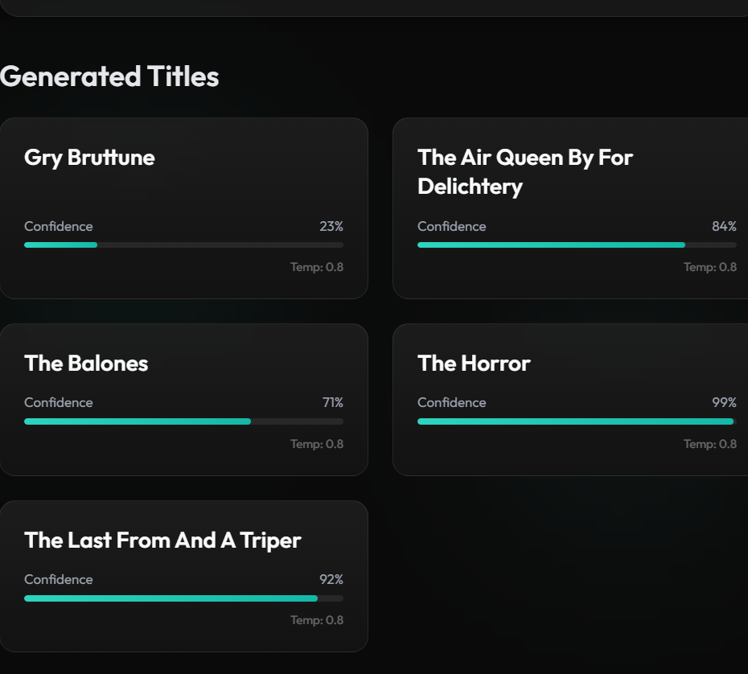

# ChronicleAI

> **AI-powered Novel Title Generator using a Character-Level Neural Network**

ChronicleAI is a local AI-powered web application that generates creative novel titles using a **character-level neural network** trained on a curated dataset of fiction titles. Users can optionally provide a starting prefix, adjust the creativity of the generated titles through temperature sampling, compare different generation modes, and explore multiple title suggestions through a clean and responsive web interface.

---

## Demo
  


---

## Getting Started

These instructions will help you set up ChronicleAI on your local machine for development and testing.

---

## Prerequisites

Install the following before running the application:

- Python 3.10+
- pip
- Git

---

## Installing

Clone the repository:

```bash
git clone https://github.com/charanadonuru/chronicleAI.git
cd chronicleAI
## Installing

Install the required packages:

```bash
pip install flask torch
```

Run the application:

```bash
python app.py
```

Open your browser and visit:

```text
http://127.0.0.1:5000/
```

---

## Features

- AI-powered novel title generation
- Character-level neural network inference
- Optional starting prefix for guided generation
- Three creativity modes:
  - Conservative
  - Balanced
  - Creative
- Generate multiple titles simultaneously
- Compare outputs across creativity modes
- Confidence-style score for generated titles
- Responsive dark-themed user interface
- Fully local execution

---

## How It Works

ChronicleAI uses a trained **character-level neural network** to generate text one character at a time.

1. The trained model is loaded when the application starts.
2. The user selects a creativity mode and optionally enters a starting prefix.
3. The backend generates titles by repeatedly predicting the next character until an end token is reached.
4. The generated titles are filtered, formatted, and returned to the frontend.
5. The web interface displays the generated titles along with their confidence scores.

Temperature sampling controls creativity:

- **Conservative**: More predictable titles
- **Balanced**: Natural balance between coherence and creativity
- **Creative**: More diverse and experimental outputs

---

## Project Structure

```text
chronicleAI/
app.py
model.py
model.pt
vocab.pt
fiction_clean.txt
templates/
templates/index.html
static/
static/css/
static/css/style.css
static/js/
static/js/main.js
assets/
assets/demo.gif
README.md
```

---

## Running the Application

Start the Flask server:

```bash
python app.py
```

Visit:

```text
http://127.0.0.1:5000/
```

Generate titles by:

- Choosing a creativity mode
- Optionally entering a prefix
- Clicking **Generate Titles**
- Comparing outputs using **Compare Modes**

---

## Built With

- **Python**: Backend programming language
- **Flask**: Web framework
- **PyTorch**: Character-level neural network implementation
- **HTML5**: Frontend structure
- **CSS3**: User interface styling
- **JavaScript**: Frontend interactivity

---

## Important Files

| File | Purpose |
| --- | --- |
| `app.py` | Flask application and API routes |
| `model.py` | Model loading and title generation logic |
| `model.pt` | Trained model weights |
| `vocab.pt` | Character vocabulary |
| `fiction_clean.txt` | Training dataset |
| `templates/index.html` | Main web page |
| `static/css/style.css` | Application styling |
| `static/js/main.js` | Frontend interactions |
| `assets/demo.gif` | Demo GIF for the README |

---

## Future Improvements

- Genre-specific generation
- Larger and more diverse training datasets
- Save favorite titles
- Export generated titles
- Beam search decoding
- User feedback-based ranking

---

## Author

**Donuru Charana Reddy**
